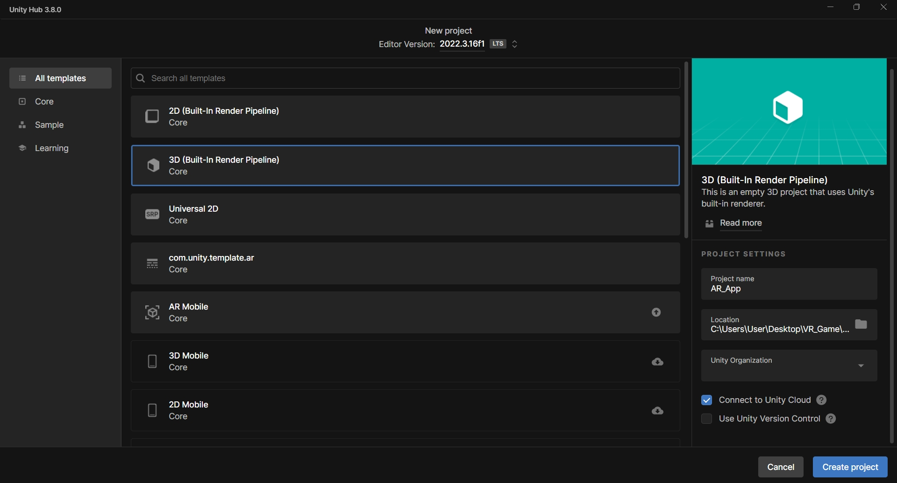
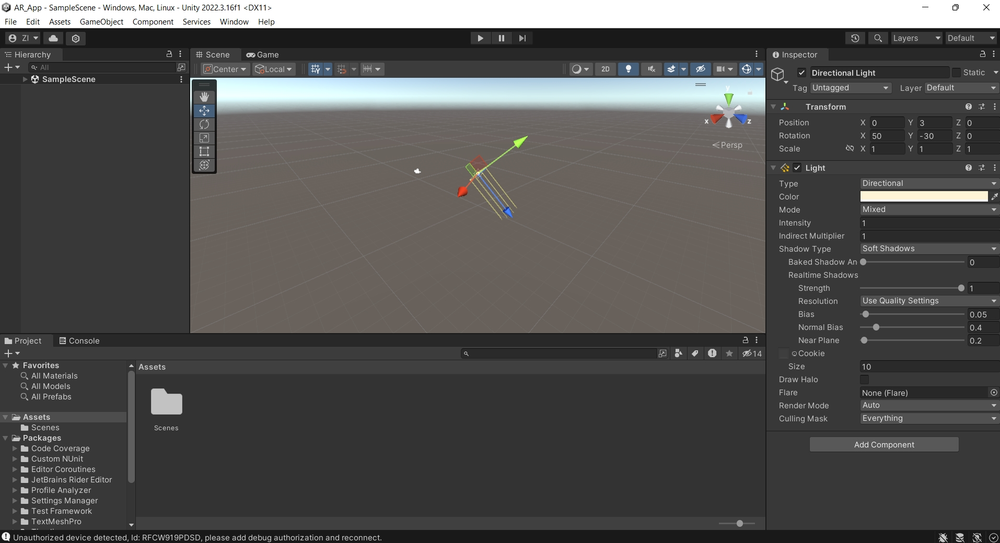
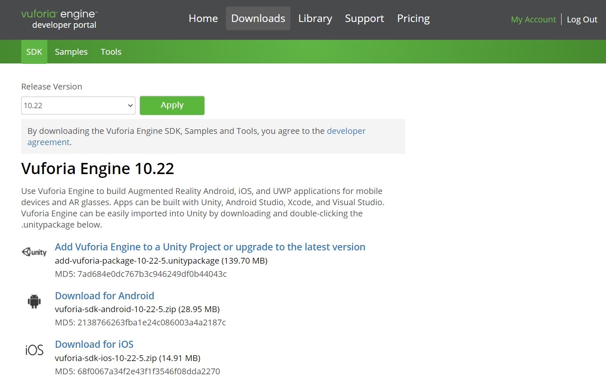
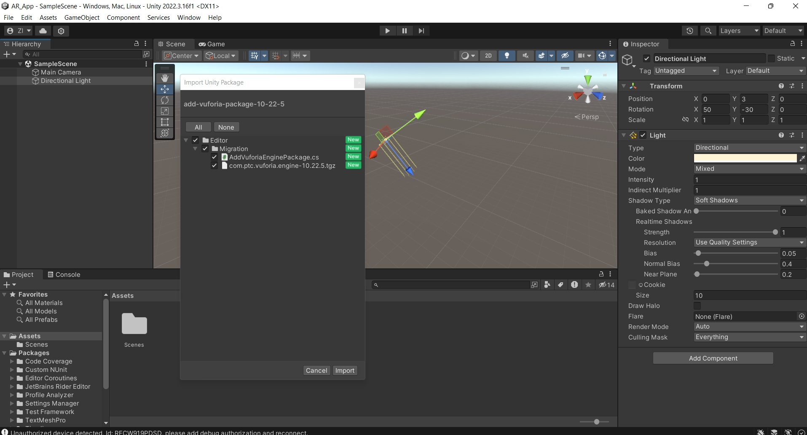
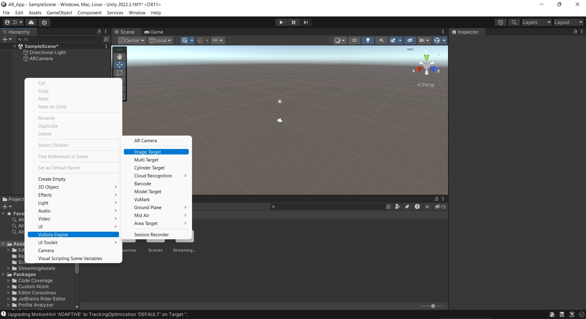

# Augmented Reality Android Application with Unity 3D & Vuforia

This repository contains a basic Android application with Augmented Reality (AR) features.

## Prerequisites

Before running the application, make sure you have the following:

- Android Studio (version XYZ or higher)
- Android device or emulator running Android OS XYZ or higher

## Getting Started

To get started with the application, follow these steps:

1. Clone this repository to your local machine using the following command:
   'git clone https://github.com/your-username/AR_App.git'
   
3. Add and Open the project in Unity 3D.

4. Build and run the application on your Android device or emulator.

## Contributing

Contributions are welcome! If you have any suggestions, bug fixes, or new features to add, please feel free to open an issue or submit a pull request.

## License

This project is licensed under the [GNU License](LICENSE).

## Screenshots

You can find more screenshots in the [screenshots](screenshots) folder.
